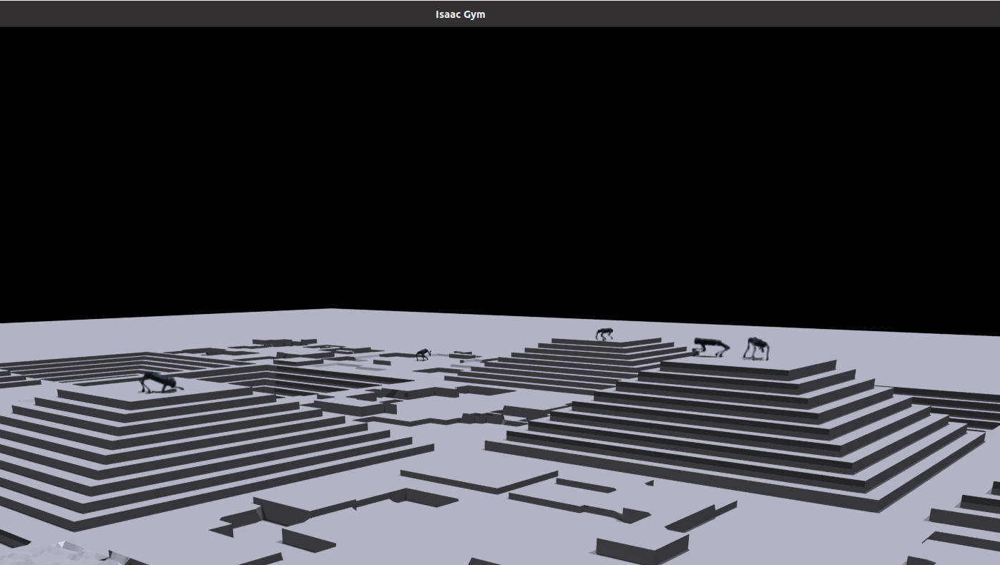
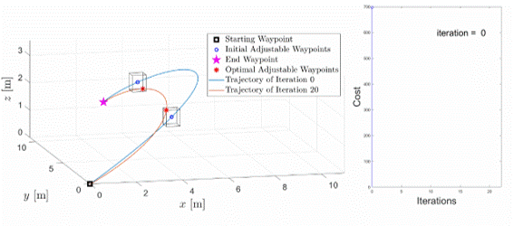
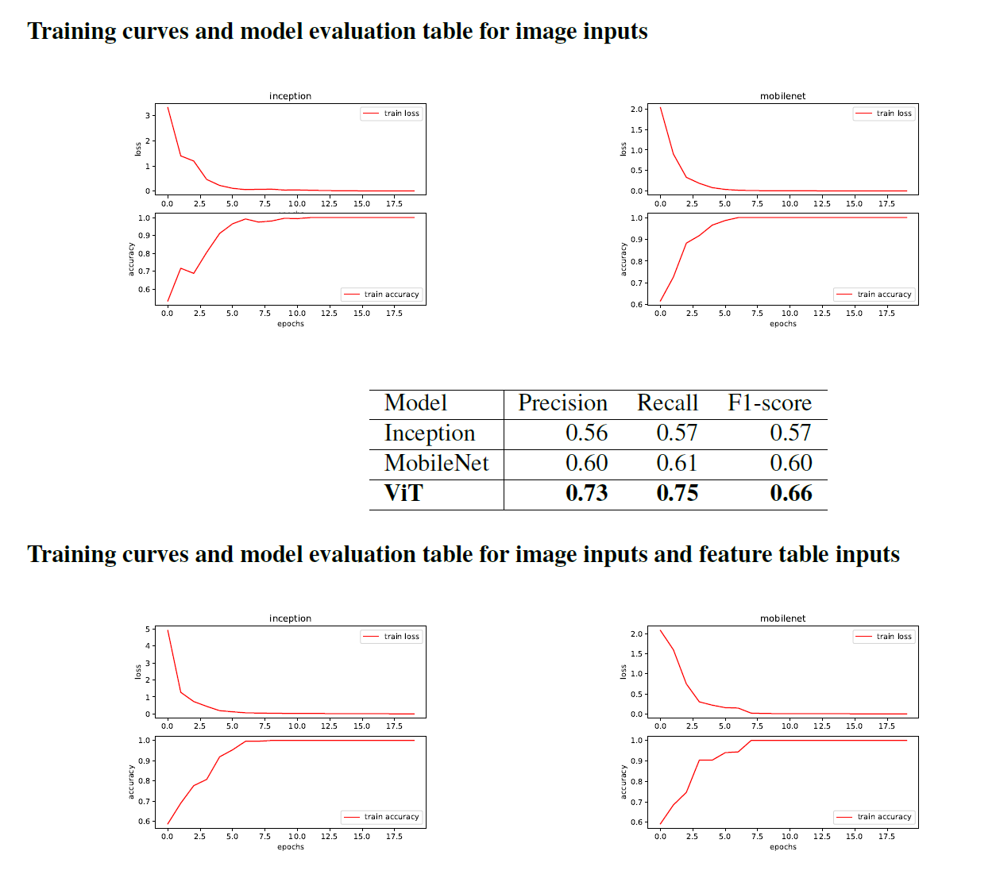

<!-- add a statement of research problems that I want to solve here. -->

<!-- Current projects -->
------
**Data driven deep reinforcement learning based quadrupedal robot control and locomotion development**\
***Internship project in Unitree Robotics***\
\
 Deep reinforcement learning involves training a robot to navigate and control its movements by learning from its interactions with the environment. The project focuses on the development of robot locomotion and controls through the implementation of deep reinforcement learning (DRL) techniques. The project aims to enhance the robustness, efficiency, and adaptability of robotic systems, paving the way for more sophisticated and autonomous robots capable of navigating complex environments with precision and intelligence.\
 *What I have done in this project:*\
• Developed the novel quadrupedal robot locomotion and controls framework with deep reinforcement learning that increases the robot payload by 15% compared with traditional model-based control framework\
• Trained the quadrupedal robot locomotion and controls policy based on deep reinforcement learning with Isaac Gym\
• Developed the quadrupedal robot learning-based locomotion and controls model deployment program with C++\
• Conduct quadrupedal robot multi-gaits walking test using trained deep reinforcement learning control policy and analyzed the test data for sim-to-real evaluation\
• Developed the quadrupedal robot state estimator using sensor fusion techniques based on Extended Kalman Filter, increasing the estimation accuracy by 23%\
***Example video can be found [here](https://github.com/Qianzhong-Chen/Qianzhong-Chen.github.io/blob/master/files/unitree_video.mp4)***

**Development on Autonomous Unmanned Aerial Vehicles (UAV)**\
***Research Assistant, Advanced Controls and Research Laboratory, UIUC***\
***Supervisor: Dr. Naira Hovakimyan, Professor of Mechanical Science and Engineering Department, UIUC***\
<!-- \ -->
\
We propose a framework for fast trajectory planning for unmanned aerial vehicles (UAVs). Our framework is reformulated from an existing bilevel optimization, in which the lower-level problem solves for the optimal trajectory with a fixed time allocation, whereas the upper-level problem updates the time allocation using analytical gradients. The lower-level problem incorporates the safety-set constraints (in the form of inequality constraints) and is cast as a convex quadratic program (QP). Our formulation modifies the lower-level QP by excluding the inequality constraints for the safety sets, which significantly reduces the computation time. The safety-set constraints are moved to the upper-level problem, where the feasible waypoints are updated together with the time allocation using analytical gradients enabled by the OptNet. We validate our approach in simulations, where our method's computation time scales linearly with respect to the number of safety sets, in contrast to the state-of-the-art that scales exponentially.\
 *What I have done in this project:*\
• Developed a collision-free bilevel trajectory optimization system with optimal waypoints’ temporal and spatial assignment for autonomous quadrotor’s motion planning based on convex optimization, increasing the computational efficiency by 150%. The work has been published on IEEE RA-L and presented on IROS 2023, the paper can be found [here](https://ieeexplore.ieee.org/document/10117594)\
• Deployed the trajectory generation program together with path planning system on Nvidia TX2 onboard computer\
• Co-designed and manufactured the prototype of omnidrone, a new type of fully-actuated UAV with six motors\
• Designed and conducted experiments to evaluate different motors’ thrust- and torque-throttle curves under different battery conditions based on NI-DAQ and LabView

**Deep Learning for Glaucoma (an ophthalmic disease) Detection with Medical Images**\
***Team Leader, Course Project of CS 229 Machine Learning***
\
Computer vision techniques have been widely employed to solve various image analysis problems, especially in the world of medecine. Deep learning and computer vision provide precious tools for early diagnosis of multiple diseases using medical imagery. In this project, we focus on developing models to detect glaucoma using OCT eye fundus images.Our dataset consists of 650 labeled eye-fundus images and a small table of extracted features for each of the images, and both the images and the extracted features were used to run the deep learning models. Model evaluation was performed using F1 score, precision and recall metrics.\
 *What I have done in this project:*\
• Preprocessed medical images, including image resizing, noise reduction, essential feature extraction\
• Conduct training with 3 CNN models (ResNet101, VGG16, MobileNet) on preprocessed dataset\
• Aiming at small dataset (500 images), conduct different methods including data augmentation, different splitting, fine-tunning the pre-trained model and cross validation, increasing the detection precision by 7%\
• Trained the images with Vision Transformer, achieving detection precision of 75%\
***Project final paper can be found [here](https://github.com/Qianzhong-Chen/Qianzhong-Chen.github.io/blob/master/files/cs229_final_project.pdf), poster can be found [here](https://github.com/Qianzhong-Chen/Qianzhong-Chen.github.io/blob/master/files/cs229_poster.pdf)***

**Intelligent Sign Language Robot Development**
***Team Leader, Capstone Project of ZJU-UIUC Institute***
<!--    -->
 \
This project proposes a novel intelligent assistant to help people with speech or hearing impairments communicate and seek help. The intelligent assistant includes a bionic hand of 17 degrees of freedom (DOFs) and an innovative neural network that recognizes American Sign Language (ASL). The users can prompt a question in ASL, and the assistant would recognize the problem and search for the answer online, answering and helping the user with ASL co-generated by the microcontroller unit and the bionic hand. Meanwhile, the answer would be demonstrated on a digital screen for inspection.\
*What I have done in this project:*\
• Designed and developed the sign language robot hardware system, including a 17 degrees of freedom dexterous bionic hand, a STM-32 microcontroller, a NVIDIA Jetson Nano onboard computer\
• Developed the control algorithm and program of the robot, designed the movement of each joint motor based on standard American Sign Language\
• Co-developed the image detection program to identify customer’s sign based on YOLO-V5\
***Project final paper can be found [here](https://github.com/Qianzhong-Chen/Qianzhong-Chen.github.io/blob/master/files/ECE445_Final_Report.pdf), demonstration video can be found [here](https://github.com/Qianzhong-Chen/Qianzhong-Chen.github.io/blob/master/files/ECE445_video.mp4)***

